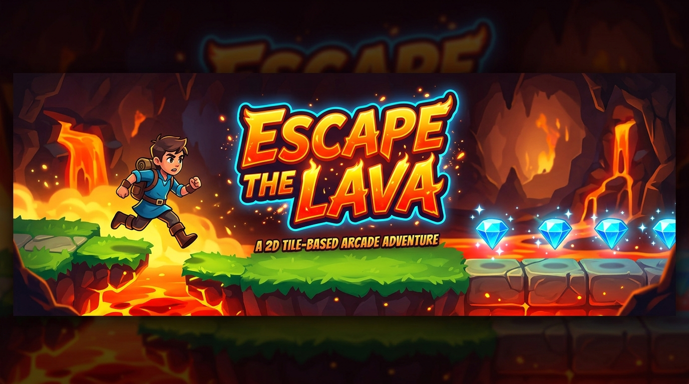
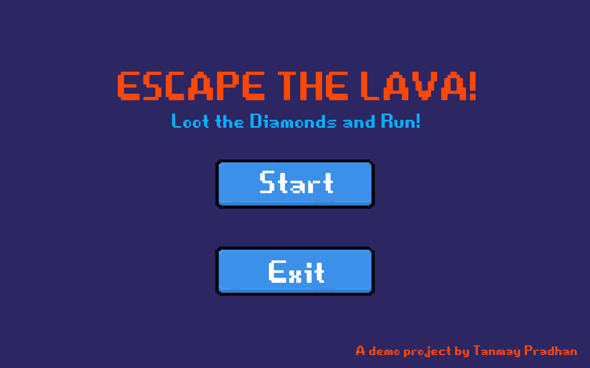
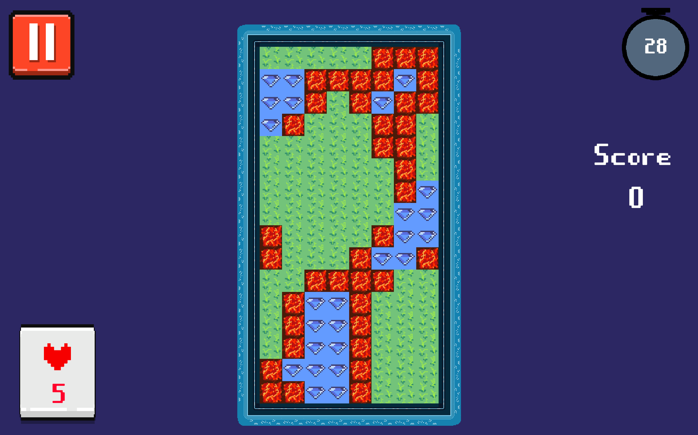
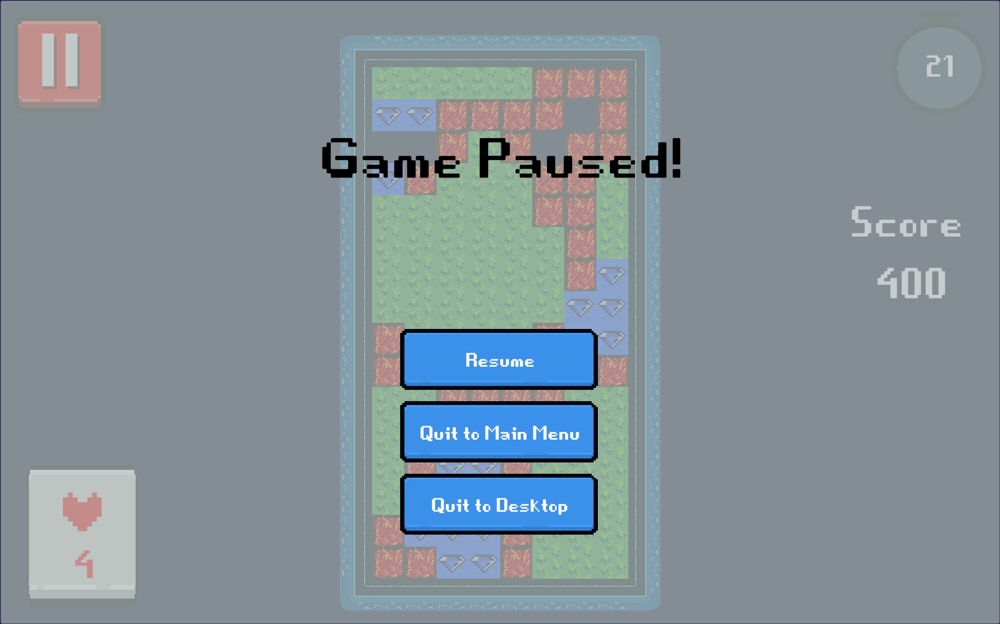
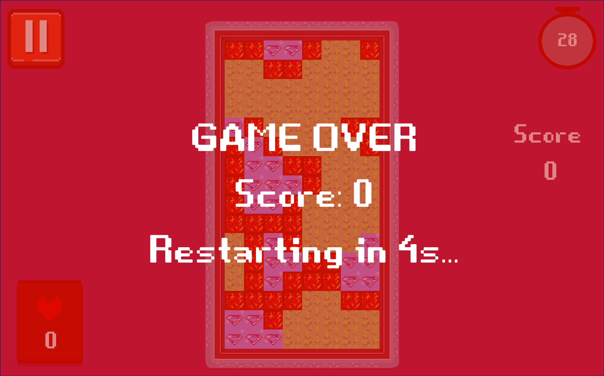
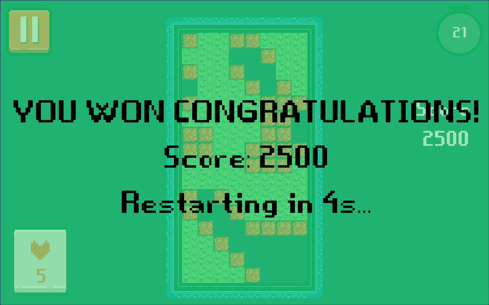

# Escape the Lava

Assignment project for **FOG Games Recruitment**. An arcade-style, fast-paced game where players aim to collect all diamonds in a grid while avoiding lava tiles within a tight time window.

---

## Game Overview

**Escape the Lava** places players on a procedurally generated tile grid filled with safe ground, high-value diamond collectibles, and deadly lava hazards. Players must interact with tiles to gather every diamond on the board before the round timer expires without running out of lives.

---

## Tile Types & Prefabs

* 🏝️ **Island / Grass Tile**: Safe terrain. Interacting with an island tile triggers subtle grass particle effects and ambient rustling sound.
* 🌋 **Lava Tile**: Hazard terrain. Interacting with lava deducts a life point, triggers fire particle VFX, and plays damage audio. If lives reach zero, a Game Over state is triggered.
* 💎 **Diamond Tile**: Primary collectible. Interacting with a diamond awards score points, triggers a sparkling pickup particle VFX and score popup, and plays a positive sound effect.
* 🧱 **Wall & Corner Tiles**: Structural boundary elements that surround the playable tile grid.

---

## System Architecture & Script Breakdown

The project follows a modular, event-driven architecture in Unity using C# and the New Input System.

### 1. Game Lifecycle & State Management (`GameManager.cs`)
* **Core Responsibilities**: Acts as a central Singleton coordinator for round states (`Playing`, `GameOver`, `LevelComplete`).
* **Stats Tracking**: Manages player score, remaining lives, round timer countdown, and diamond collection targets.
* **Event System**: Dispatches C# events (`OnScoreChanged`, `OnLivesChanged`, `OnTimerChanged`, `OnGameStateChanged`) to decouple core game logic from UI updating.
* **Auto-Restart**: Handles configurable automatic round restarts with countdown delays upon game end.

### 2. Procedural Grid Generation (`GridManager.cs`)
* **Core Responsibilities**: Procedurally builds dynamic grid layouts based on configurable columns and rows.
* **Clustered Tile Distribution**: Uses Perlin noise sampling to group tile types (Island, Lava, Diamond) into natural clusters based on distribution count settings.
* **Auto-Sizing & Bordering**: Calculates tile spacing automatically from sprite dimensions and constructs surrounding wall/corner borders with appropriate rotations.

### 3. Interactive Tile Logic (`Tile.cs`)
* **Core Responsibilities**: Controls per-tile input detection using Unity's New Input System pointer events.
* **Input Debouncing**: Features frame-level debouncing (`lastProcessedFrame`) to prevent multi-touch or double-click bugs during rapid interactions.
* **Action Execution**: Triggers specific game state changes, particle spawn requests via `VFXController`, and sound cues via `AudioManager` based on the assigned `TileType`.

### 4. User Interface Controller (`UIManager.cs`)
* **Core Responsibilities**: Controls HUD text displays (Score, Lives, Timer), outcome overlays, and the Pause Menu.
* **Visual Urgency Effects**: 
  * Animates smooth background/text color pulsing on the Lives UI when health drops below 3.
  * Flashes the Timer UI red when less than 10 seconds remain.
* **Overlay & Countdown**: Displays Game Over and Level Complete panels with real-time numerical restart countdowns.
* **Responsive Scaling & Input Integration**: Automatically configures `CanvasScaler` for 1920x1080 reference resolution and upgrades the scene `EventSystem` to use `InputSystemUIInputModule`.

### 5. Main Menu Navigation (`MainMenuManager.cs`)
* **Core Responsibilities**: Manages main menu button listeners (`PlayGame`, `QuitGame`), scene transitions, and timescale resets.
* **Responsive Layout**: Ensures responsive Canvas scaling across various screen resolutions.

### 6. Audio Management System (`AudioManager.cs`)
* **Core Responsibilities**: Persistent Singleton managing background music and polyphonic sound effects.
* **Dual Channel Pools**: Separates BGM looping from an SFX audio source pool to allow overlapping sound effect playback.
* **Sound Triggers**: Provides dedicated methods for playing pickup sounds, lava damage audio, tile interaction steps, level completion fanfare, game over sounds, and UI button clicks.

### 7. Visual Effects Manager (`VFXController.cs`)
* **Core Responsibilities**: Singleton controller responsible for spawning and cleaning up particle effects.
* **Lifecycle & Sync**: Instantiates particle prefabs at specified world positions, calculates particle lifetimes dynamically, schedules auto-destruction, and triggers synchronized sound effects.

---

## Screenshots & Media

### Gameplay Video

[![Watch Gameplay Video]](docs/videos/gameplay.mp4?raw=true)

[▶️ **Click here to watch / download the full Gameplay Video (MP4)**](docs/videos/gameplay.mp4?raw=true)

### Screenshots

| Main Menu | Gameplay Grid |
| :---: | :---: |
|  |  |

| Pause Menu | Game Over Overlay | Win Overlay |
| :---: | :---: | :---: |
|  |  |  |

---

## Controls

* **Left Mouse Click / Touch Tap**: Interact with tiles / Press UI Buttons
* **Escape / P**: Toggle Pause Menu

---

## Technical Specifications

* **Engine**: Unity 2022 / 6000+
* **Input System**: Unity Input System Package (`UnityEngine.InputSystem`)
* **UI**: TextMeshPro & Unity UI (`UnityEngine.UI`)
* **Target Resolution**: 1920 x 1080 (Responsive scaling enabled)
